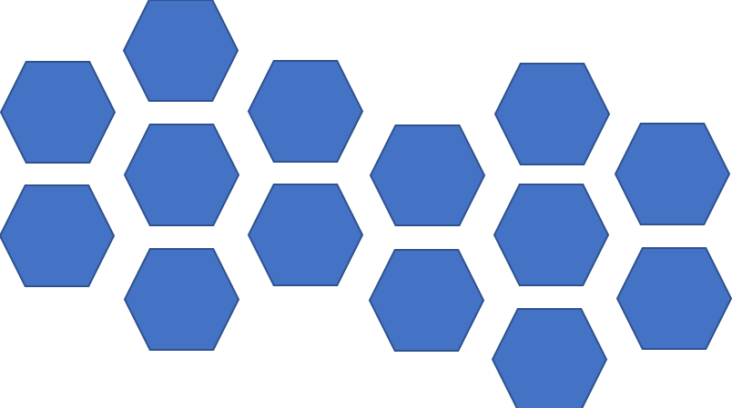

Hex-says

Wireframe

Hex-says is an unique version of the classic game, Simon Says. The rules to Simon Says are simple: a sequence will be played and the user will need to play the exact same sequence in order to move on.

Hex-says has the same rules, but the sequence can include up to 14 different selections. The game starts with 7 possible selections and 1 is added on after each round is passed. Similar concept, the first round has a sequence of 3 selections and then one more is added to that sequence each time.

Using JavaScript, I created various functions, manipulated the DOM and stylesheet to attach event listeners to begin the game, for smooth transitions between each round and sequence, and to create a 3D object flip effect on the hexagons. 

Game walkthrough:
1. The user is greeted with the title screen, which includes a "Start" button
2. The user clicks the "Start" button, which reveals the first set of tiles, plays the the first sequence of 3 selections, and includes music (for the mood :).

3. After the sequence is played the user is prompted to copy the sequence with "your turn."

4. The user is awarded 1 point for each correct selection and 10 points for passing the round.

5a. If the user plays the correct sequence then then they move on to the next round, the sequence plays.
5b. If the user plays the correct sequence and they have reached the last level, the user is a WINNER!
5c. If the user plays the incorrect sequence then the music will stop and the user will see a "Game Over" screen along with a "try again" button. The "try again" button will send the user back to the title screen

Wireframe & visuals: From the start I wanted to play with geometric shapes. In order to create each hexagon, I used 3 
s. The sides were made of the border of a div with 0 width & height, and the center was a porportionally sized rectangular 
. Then, to create the "flowers" I used CSS flexbox.

I hoped to take a simple game and make it a bit more fun, challenging, but also asthetically pleasing. 

I hope you enjoy this little brain teaser!

Future Improvements:
1. leaderboard to save previous players
2. better timing
3. I may want to make this a gam platform where users can play multiple different games.

